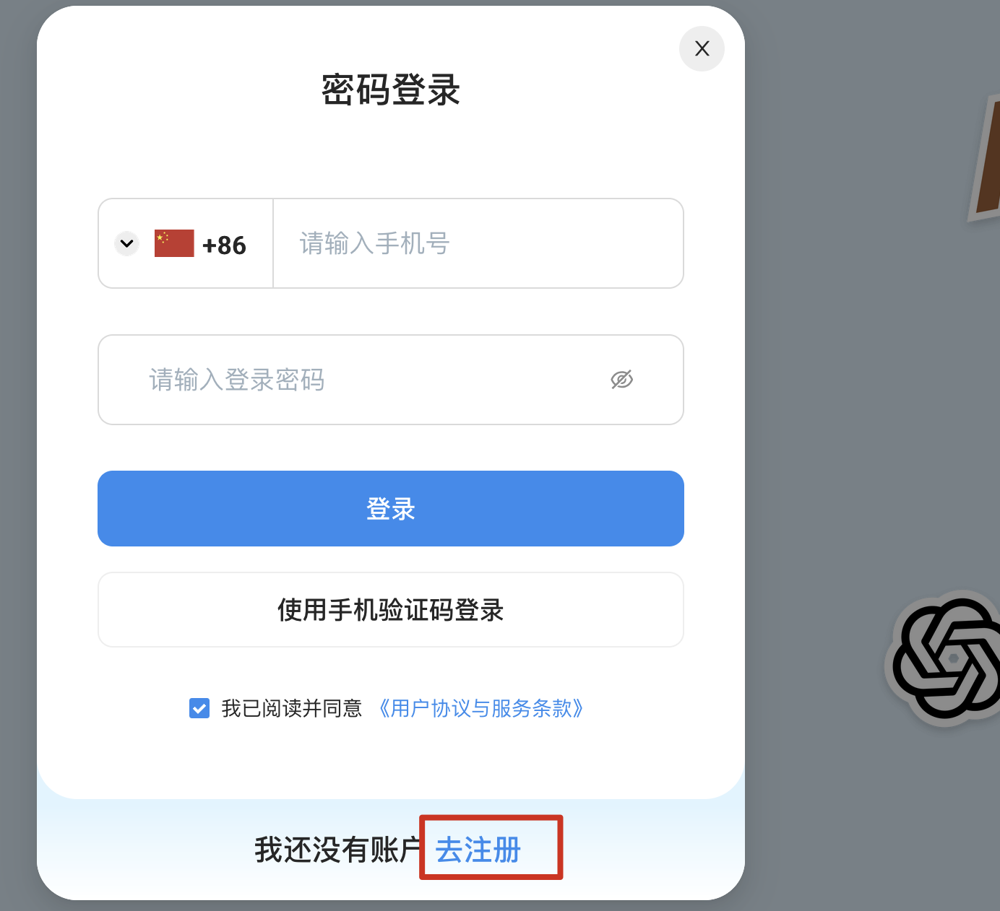
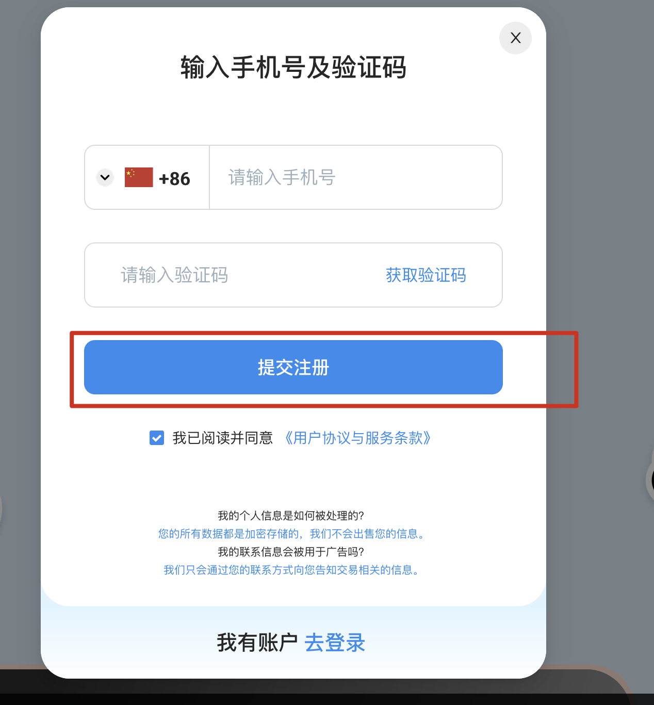
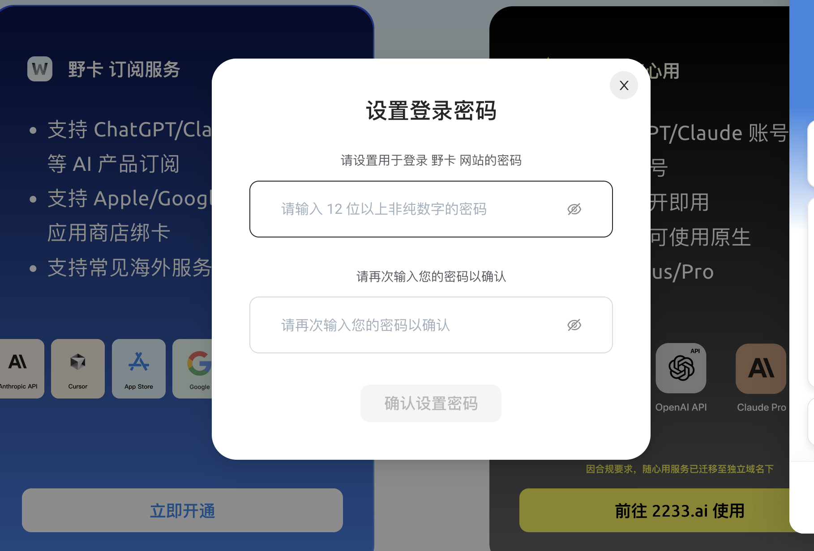
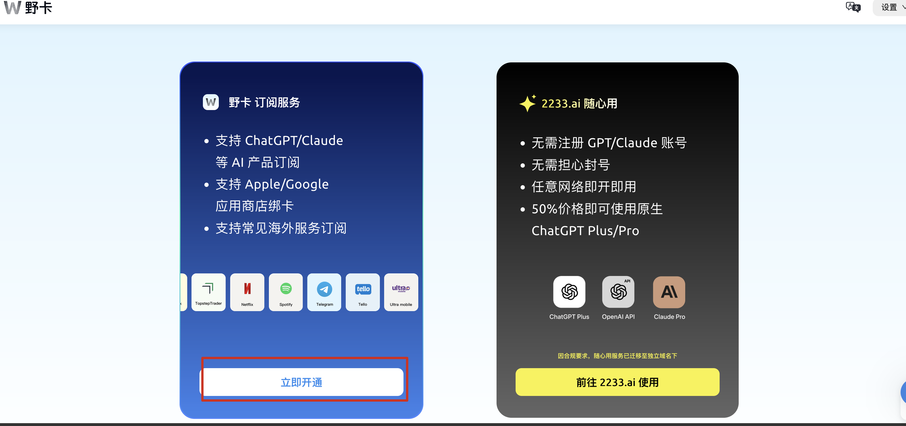
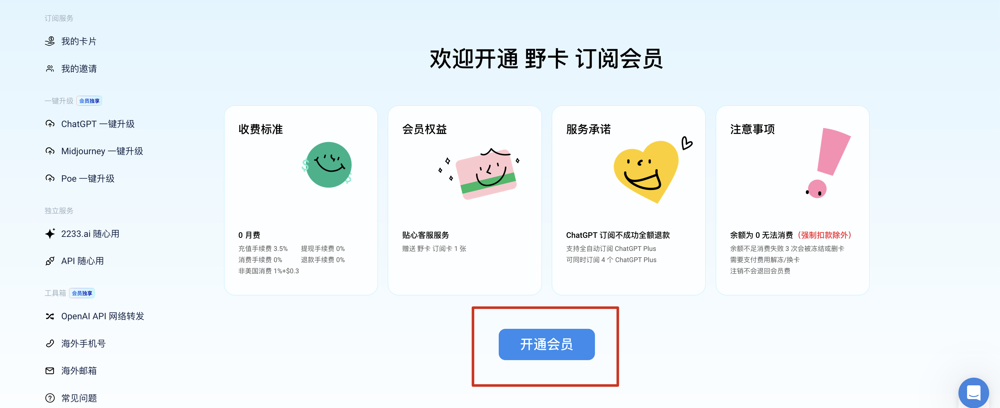
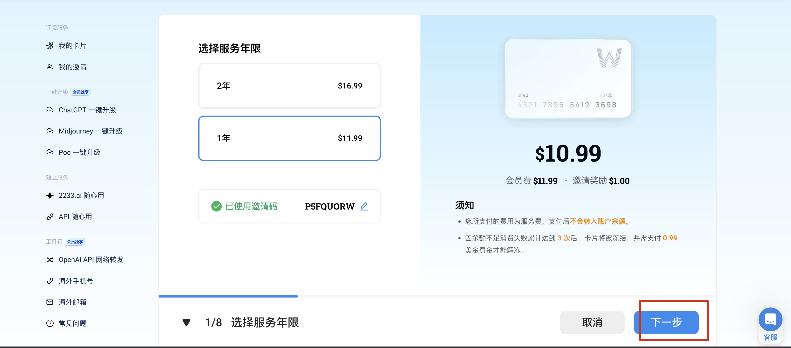
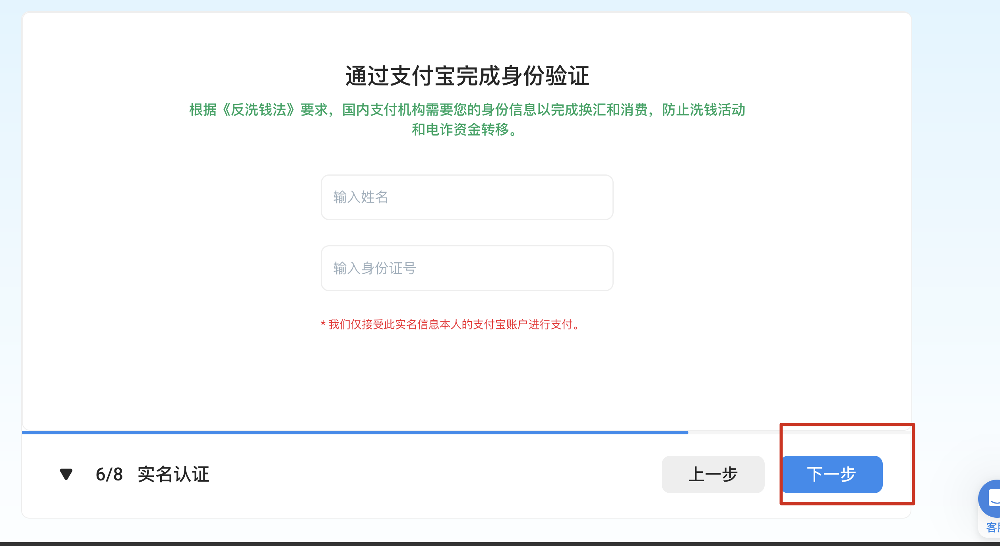
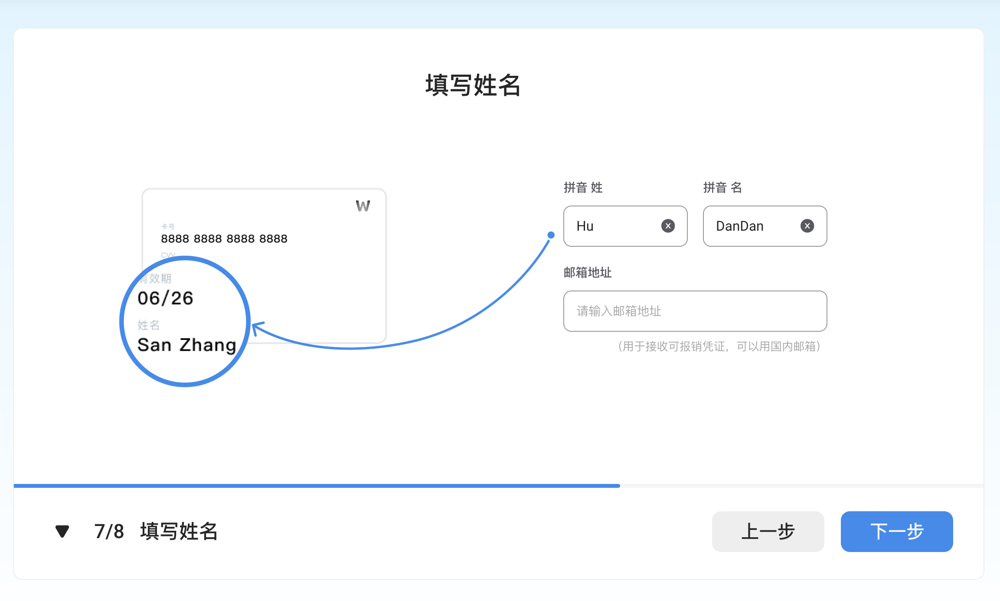
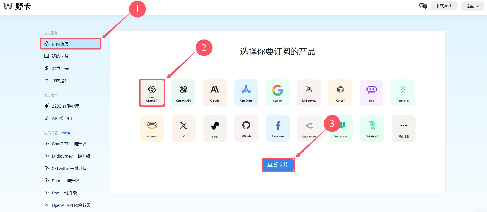
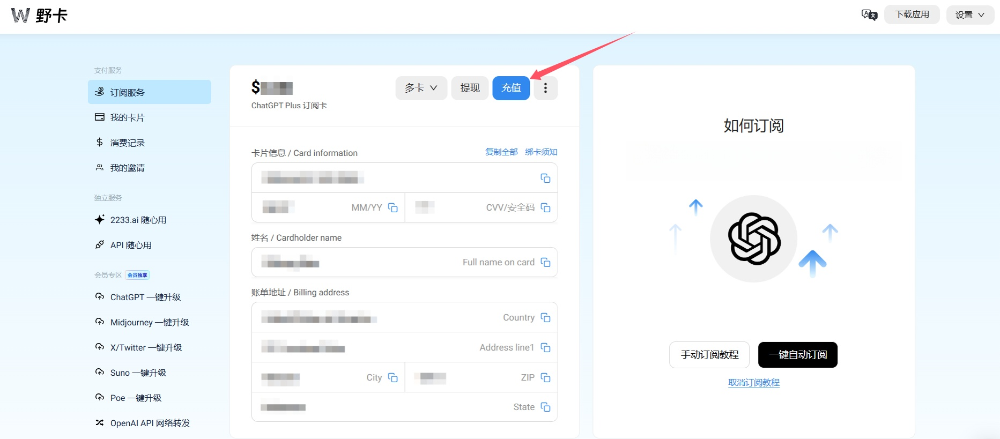

# 💳 2025 ChatGPT Plus 升级教程（虚拟卡解决方案 · 野卡实测成功）

欢迎来到 ChatGPT 助手站！

本教程将手把手教你如何成功升级 ChatGPT Plus，即使你没有海外信用卡，也能通过国内用户友好的【野卡虚拟卡】顺利完成付款。

---

## ✅ 为什么值得升级 ChatGPT Plus？

| 功能 | 免费用户 | Plus 用户 |
|------|-----------|------------|
| 模型 | GPT-4o （部分功能受限） | GPT-4.5 预览 + GPT-4o（无使用限制） |
| 文件上传 | 限次 | 批量、高频 |
| 高级数据分析 | 无 | ✅ 支持 |
| 图片生成 | 有限制 | ✅ 高速、高清、风格丰富 |
| 网页搜索 | ✅ 有限制 | ✅ 无限制 |
| 语音对话 | 标准模式 | 标准 + 高级语音 |
| 自定义 GPT | 有限制 | ✅ 可执行任务与项目流 |
| Sora 视频生成 | 无 | ✅ 有机会参与内测 |

📌 Plus 版本是**ChatGPT 最完整形态**，适合日常办公、编程、自媒体、AI 工具创业等高强度使用者。

---

## 💢 国内用户升级常见痛点

- ❌ 国内信用卡无法绑定支付
- ❌ 账单地址填写错误被拒
- ❌ 淘宝/闲鱼代充风险高、价格贵
- ❌ 合租账号隐私极低、不受控制

---

## ✅ 最稳定解决方案：使用「野卡」虚拟信用卡

### 🔹 什么是野卡？

野卡是一款支持国内用户注册、可用于海外网站消费的虚拟 Visa 信用卡，**亲测可用于 ChatGPT Plus、Claude、Midjourney 等订阅平台支付**。

### ✅ 优势总结：

- ✅ 在线开卡，微信/支付宝直接充值（人民币转美元）
- ✅ 无需海外身份证、地址等麻烦操作
- ✅ 无月费，无手续费，仅收一次性服务年费
- ✅ 可开多张卡片，对应不同平台使用

---

### 💰 野卡费用说明（一定要提前告诉你）

| 服务期限 | 官方价格 | 使用推荐码后 |
|----------|-----------|----------------|
| 1 年会员 | $11.99 | **$10.99** ✅ |
| 2 年会员 | $16.99 | **$15.99** ✅ |

虚拟信用卡不是免费的，野卡也一样。它收一点年费，是为了维护整个支付系统和合规流程，毕竟这是为国内用户定制的正规服务，靠谱比免费更重要。
好在它不收月租，也没有任何隐藏费用，1年 $11.99，2年 $16.99，我个人觉得性价比已经很高了。

> 除了年费，野卡 **无其他隐性费用**，卡内金额全部可用于平台订阅。

📎 **推荐注册链接（含$1立减）：**  
👉 [https://yeka.ai/i/P5FQUORW](https://yeka.ai/i/P5FQUORW)

📎 推荐码：`P5FQUORW`（系统会自动填写）

---

## 🪜 注册并开通野卡流程（共 11 步）

> ⚠️ 建议注册+充值前准备：VPN 打开官网，浏览器不要开启无痕模式。

1️⃣ 访问野卡官网：[https://yeka.ai](https://yeka.ai/i/P5FQUORW)，点击右上角【登录 / 注册】


2️⃣ 点击【我还没有账户，去注册】


3️⃣ 输入 +86 手机号，获取短信验证码并点击【提交注册】


4️⃣ 设置你的登录密码


5️⃣ 进入后台后，点击左侧【立即开通】 → 然后点击【继续开通】



6️⃣ 点击【开通会员】



7️⃣ 选择服务年限，输入推荐码 `P5FQUORW`，使用支付宝完成支付（1年 $10.99）



8️⃣ 填写实名信息（姓名、身份证号）并点击【下一步】


9️⃣ 点击【完成认证】



🔟 点击左侧【订阅服务】，选择平台（如 ChatGPT）→ 查看卡片



1️⃣1️⃣ 点击【充值】，使用支付宝给你的虚拟卡充值（建议 $25 美元）



---

## 🛠 ChatGPT Plus 升级步骤

1️⃣ 登录 ChatGPT 官网：https://chat.openai.com（建议美国/新加坡节点）

2️⃣ 左下角【Settings】→【My Plan】→【Upgrade to Plus】

3️⃣ 填写卡片信息（使用你在野卡后台获取的 Visa 卡）：

```text
Card Number: 野卡卡号
Expiry Date / CVC: 野卡提供
账单地址建议填写如下：

Full Name: Your Name  
Address: 123 Main St  
City: Los Angeles  
Zip Code: 90001  
Country: United States
4️⃣ 点击确认付款，几秒后即可提示升级成功，并收到官方邮件

❓ 常见问题解答
问题	解决方案
卡被拒	检查余额或重新绑定，建议充值 $25 以上
地址错误	使用上方推荐地址或更换城市尝试
支付无反应	更换浏览器，关闭广告拦截插件
充值失败	建议使用支付宝充值（非银行卡）
🧩 推荐配套教程
📘 ChatGPT 免费注册教程（图文+免手机号）

🔐 VPN 工具推荐榜单（高成功率）

🚀 机场推荐榜单（延迟低、节点稳）

🧠 提示词大全（办公、写作、编程）

✅ 总结
现在你已经拥有：

ChatGPT 账号 ✅

虚拟 Visa 卡 ✅

可升级 Plus 的通道 ✅

📌 通过本教程，你可以 10 分钟内完成 ChatGPT Plus 开通，不再依赖他人、不再卡在支付失败的问题上。

📬 如果你觉得本教程有帮助，欢迎 Star + 分享，并使用推荐链接支持本站持续更新！

🌐 官网主页：https://chatgpt-helper-tech.github.io
📂 GitHub 源码仓库：https://github.com/chatgpt-helper-tech
