## 💳 2025 ChatGPT Plus 升级教程（虚拟卡解决方案 · 野卡实测成功）

欢迎来到 **ChatGPT 中文助手站**！

本教程将手把手教你如何成功升级 ChatGPT Plus，即使你没有海外信用卡，也能通过国内用户友好的【野卡虚拟卡】顺利完成付款。

---

## ✅ 为什么值得升级 ChatGPT Plus？

| 功能 | 免费用户 | Plus 用户 |
|------|-----------|------------|
| 模型 | GPT-4o （部分功能受限） | GPT-4.5  + o3 |
| 文件上传 | 限次 | 批量、高频 |
| 高级数据分析 | 无 | ✅ 支持 |
| 图片生成 | 有限制 | ✅ 高速、高清、风格丰富 |
| 网页搜索 | ✅ 有限制 | ✅ 无限制 |
| 语音对话 | 标准模式 | 标准 + 高级语音 |
| 自定义 GPT | 有限制 | ✅ 可执行任务与项目流 |
| Sora 视频生成 | 无 | ✅ 有机会参与内测 |

📌 Plus 版本是**ChatGPT 最完整形态**，适合日常办公、编程、自媒体、AI 工具创业等高强度使用者。

---

## 💢 国内用户升级常见痛点

- ❌ 国内信用卡无法绑定支付
- ❌ 账单地址填写错误被拒
- ❌ 淘宝/闲鱼代充风险高、价格贵
- ❌ 合租账号隐私极低、不受控制

---

## ✅ 最稳定解决方案：使用「野卡」虚拟信用卡

### 🔹 什么是野卡？

野卡是一款支持国内用户注册、可用于海外网站消费的虚拟 Visa 信用卡，**亲测可用于 ChatGPT Plus、Claude、Midjourney 等订阅平台支付**。

### ✅ 优势总结：

- ✅ 在线开卡，微信/支付宝直接充值（人民币转美元）
- ✅ 无需海外身份证、地址等麻烦操作
- ✅ 无月费，无手续费，仅收一次性服务年费
- ✅ 可开多张卡片，对应不同平台使用

---

### 💰 野卡费用说明（一定要提前告诉你）

| 服务期限 | 官方价格 | 使用推荐码后 |
|----------|-----------|----------------|
| 1 年会员 | $11.99 | **$10.99** ✅ |
| 2 年会员 | $16.99 | **$15.99** ✅ |

虚拟信用卡不是免费的，野卡也一样。它收一点年费，是为了维护整个支付系统和合规流程，毕竟这是为国内用户定制的正规服务，靠谱比免费更重要。
好在它不收月租，也没有任何隐藏费用，1年 $11.99，2年 $16.99，我个人觉得性价比已经很高了。

> 除了年费，野卡 **无其他隐性费用**，卡内金额全部可用于平台订阅。

> 🎁 **使用推荐链接，立减 $1 美元，快速开通虚拟信用卡：**  
> 👉 [点此立即注册野卡（推荐码自动填写）](https://yeka.ai/i/P5FQUORW)

> 💡 推荐码：`P5FQUORW`（系统会自动填写，无需手动）

---

## 🪜 注册并开通野卡流程（共 11 步）

> ⚠️ 建议注册+充值前准备：VPN 打开官网，浏览器不要开启无痕模式。

1️⃣ 🧭 [点此打开 yeka.ai 官网注册入口](https://yeka.ai/i/P5FQUORW)
点击右上角【登录 / 注册】按钮，完成账户创建

2️⃣ 点击【我还没有账户，去注册】
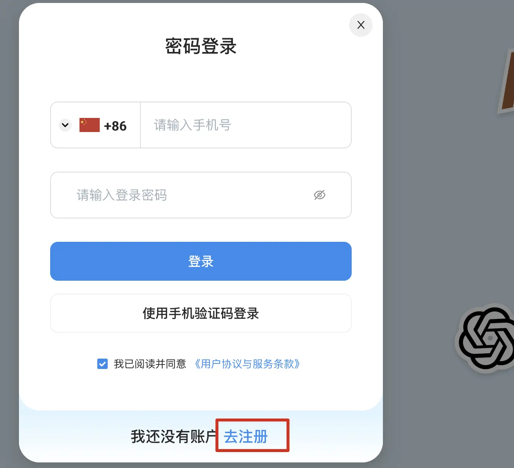

3️⃣ 输入 +86 手机号，获取短信验证码并点击【提交注册】

4️⃣ 设置你的登录密码
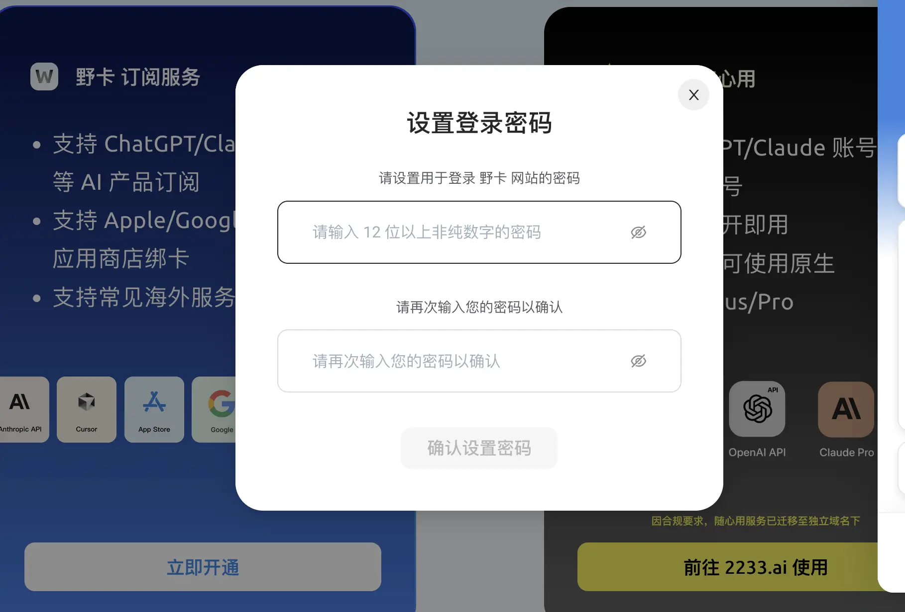

5️⃣ 进入后台后，点击左侧【立即开通】 → 然后点击【继续开通】
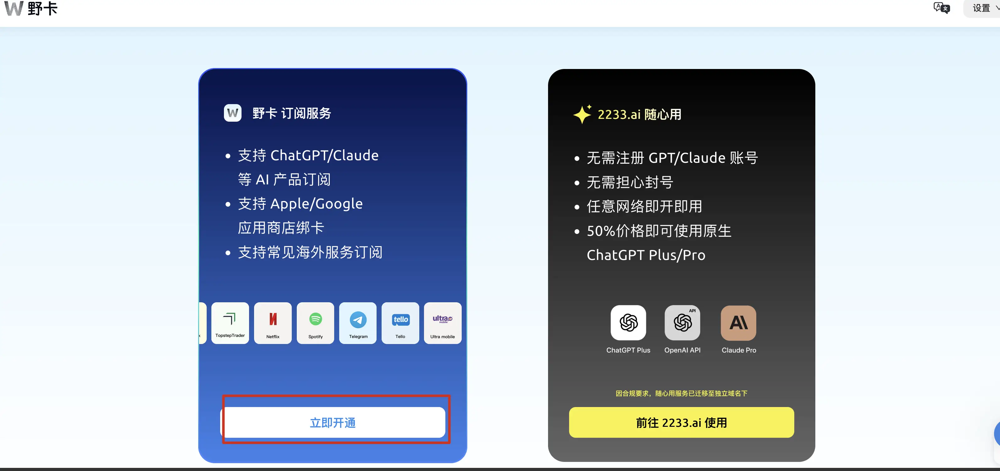

6️⃣ 点击【开通会员】
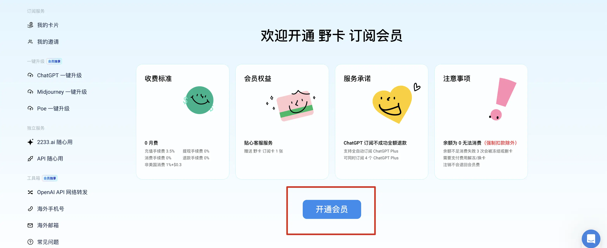

7️⃣ 选择服务年限，输入推荐码 `P5FQUORW`，使用支付宝完成支付（1年 $10.99）
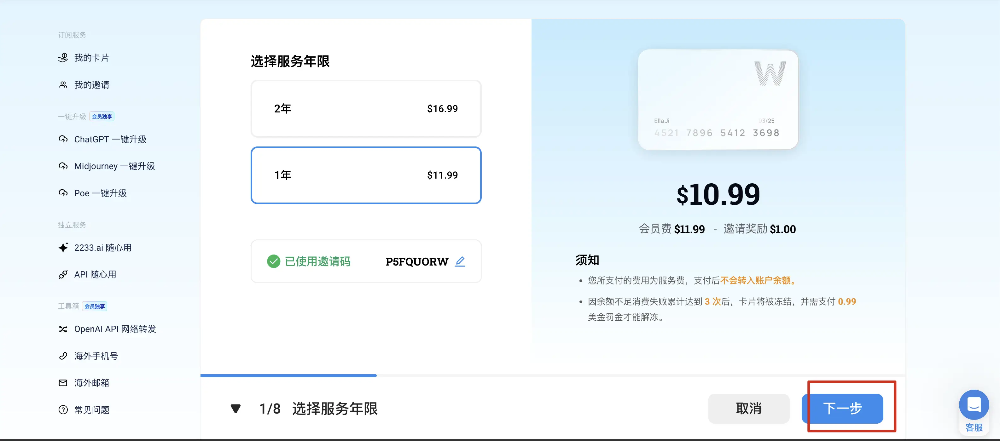

8️⃣ 填写实名信息（姓名、身份证号）并点击【下一步】
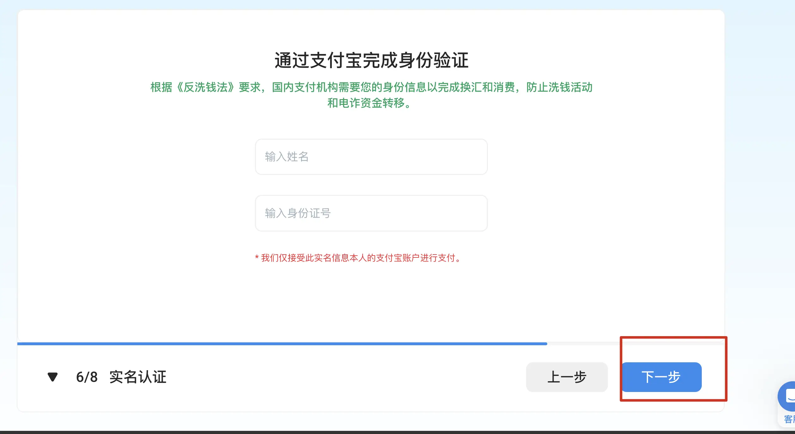

9️⃣ 点击【完成认证】
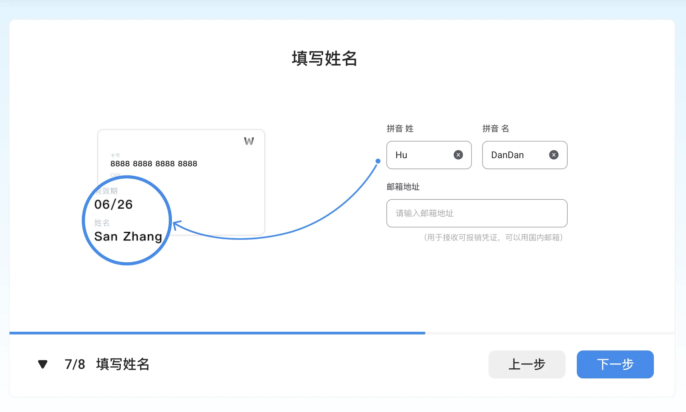

🔟 点击左侧【订阅服务】，选择平台（如 ChatGPT）→ 查看卡片
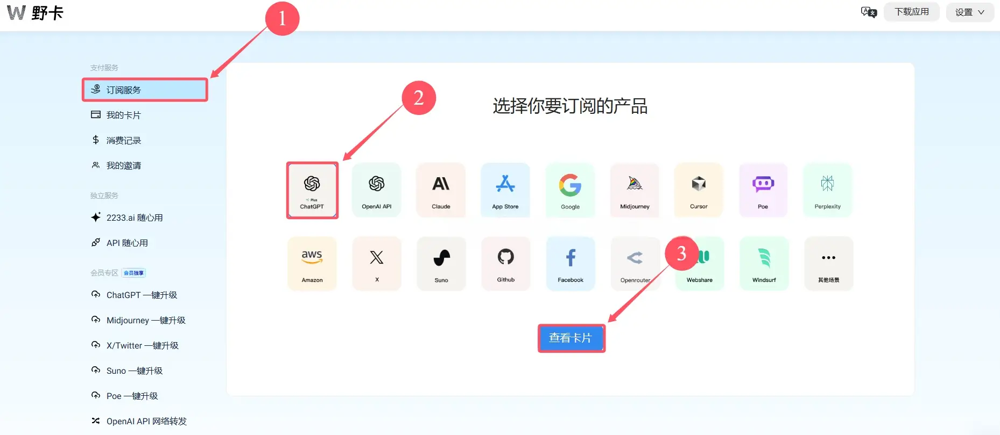

1️⃣1️⃣ 点击【充值】，使用支付宝给你的虚拟卡充值（建议 $25 美元）
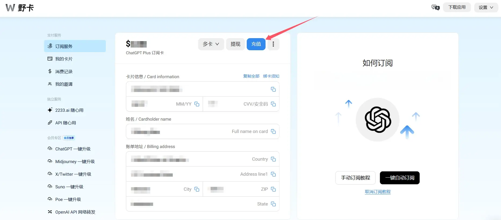

---

## 🛠 ChatGPT Plus 升级步骤

1️⃣ 登录 ChatGPT 官网，点击「升级套餐」按钮：  
👉 [https://chatgpt.com/](https://chatgpt.com/)

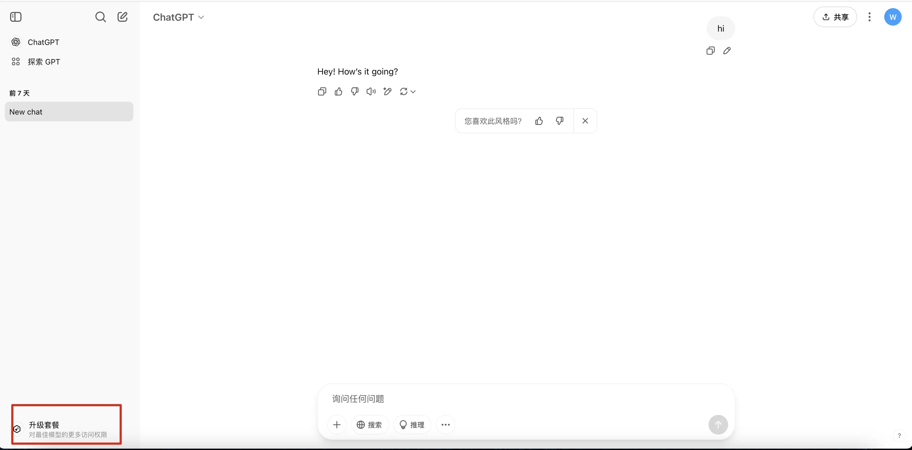

2️⃣ 寻找要升级的套餐
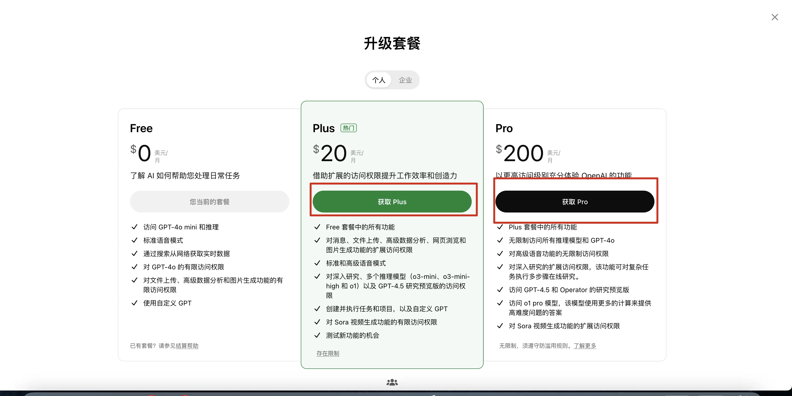

3️⃣ 复制升级的链接
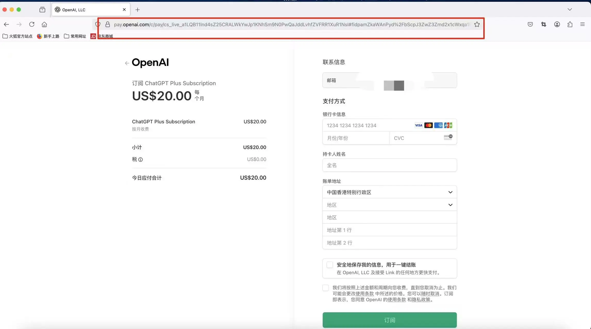

4️⃣ 回到野卡平台点击ChatGpt一键升级
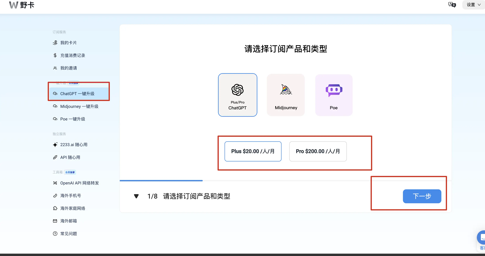

5️⃣ 将复制的链接按提示粘贴进输入框
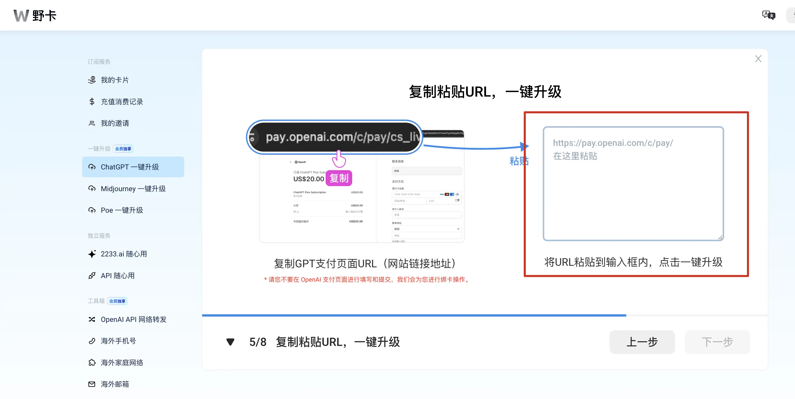

6️⃣ 按提示完成,升级成功
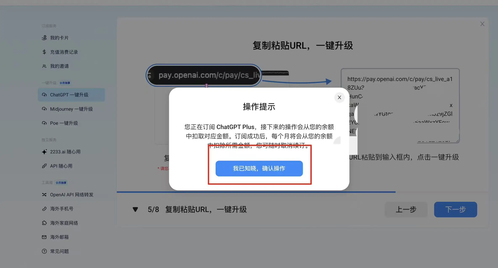

---

## ❓ 常见问题解答

问题	解决方案
卡被拒	检查余额或重新绑定，建议充值 $25 以上
地址错误	使用上方推荐地址或更换城市尝试
支付无反应	更换浏览器，关闭广告拦截插件
充值失败	建议使用支付宝充值（非银行卡）

---

## 🧩 **ChatGPT 中文助手** 站延伸阅读推荐｜ChatGPT + 科学上网必备指南

以下内容将帮助你从零开始畅享 ChatGPT、科学上网与 AI 工具使用体验：

- 📘 [ChatGPT 免费注册图文教程）](https://gptvpnhelper.com/chatgpt-register-guide/)  
  详细教你如何注册 OpenAI 账号，适配 Gmail、Outlook 注册流程。

- 📘 [ChatGPT 中文使用导航主页（持续更新）](https://gptvpnhelper.com/)  
  整合所有 ChatGPT 教程、升级攻略与辅助工具合集，适合新手收藏。

- 🔐 [2025 VPN 推荐榜单和使用教程](https://gptvpnhelper.com/network-access/)  
  对比实测多款热门 VPN（如 Surfshark、NordVPN、StrongVPN）在中国地区的连接稳定性、价格与安全性。

- ✈️ [2025 机场 推荐和使用教程](https://gptvpnhelper.com/airport-access/)  
  精选支持 Clash / V2Ray / Shadowrocket 的免费与付费机场节点服务，适合长期稳定科学上网用户。

---

## ✅ 总结

现在你已经拥有：

ChatGPT 账号 ✅

虚拟 Visa 卡 ✅

可升级 Plus 的通道 ✅

📌 通过本教程，你可以 10 分钟内完成 ChatGPT Plus 开通，不再依赖他人、不再卡在支付失败的问题上。
---

📬 本项目由 [chatgpt-helper-tech](https://github.com/chatgpt-helper-tech) 维护，面向中文用户持续更新  
📂 ChatGPT 中文助手站 主站地址：[https://gptvpnhelper.com](https://gptvpnhelper.com)  
⭐ 创作不易,如果你觉得本站有帮助，请点击 Star⭐ 或分享给有需要的朋友  
---
